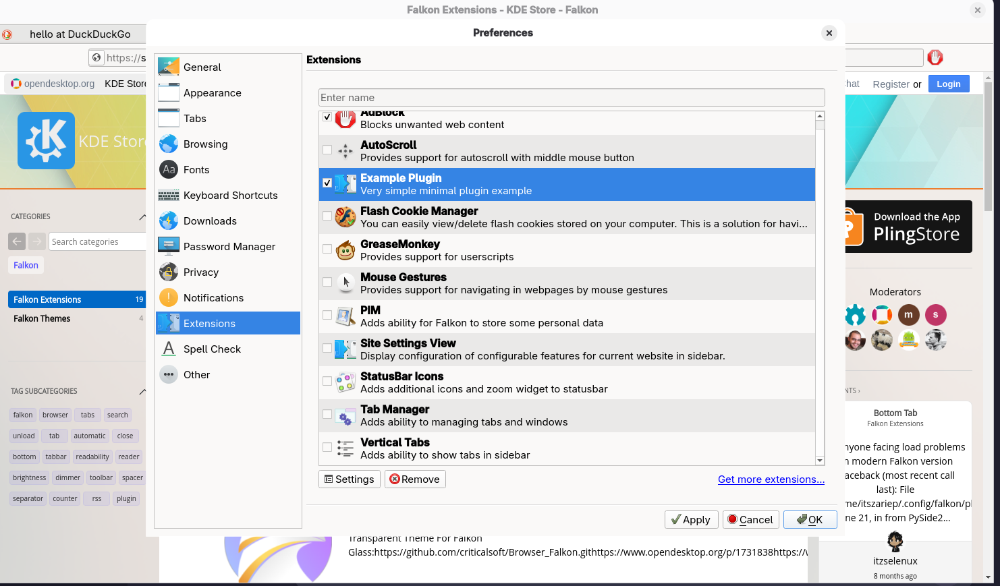

# Falkon Extension Development: Implementation Guide

*A practical guide to building Falkon from source and creating a Python-based extension using PyFalkon.*

**Monday, January 26, 2026 · 2 min read**

This guide documents the successful setup of a custom-built **Falkon Browser** with **Python plugin support**, along with deploying a minimal *Hello World* extension prototype.

It is intended as a **reference guide** for developers who want to compile Falkon from source and experiment with Python-based extensions.

> **Note:** The steps below were tested on **Arch Linux (standard version)**. Other distributions may require minor adjustments.

---

## Guide Overview

The primary goal was to build Falkon from source to ensure the **PyFalkon** (Python bridge) was correctly linked. This enables the development of Python-based extensions such as custom tooling, automation, or experimental features like an XMPP client.

---

## Compiling Falkon from Source

Compiling from source ensures that Falkon and its Python bridge are built against the same system headers and libraries.

### Prerequisites

- **Qt Framework**
  - `qt5-webengine`
  - `qt5-tools`
  - `qt5-base`

- **Python Tools**
  - `python-pyside2`
  - `shiboken2`  
  *(Required for Python ↔ Qt bindings)*

- **Build System**
  - `cmake`
  - `extra-cmake-modules`

---

### Build Steps

#### 1. Initialize the build directory

```bash
mkdir build && cd build
cmake ..
```

#### 2. Compile:

```
make -j$
```
## Extension Architecture

Falkon extensions require two primary files contained within a unique folder.

### Folder Location
For custom builds, the browser prioritizes its own binary path:
`~/falkon/build/bin/plugins/hello_python/`

### A. The Metadata Descriptor (`metadata.desktop`)
This file registers the extension with the Falkon plugin manager.

```ini
[Desktop Entry]
Name=Hello Python World
Comment=My first Python extension for Falkon
Icon=utilities-terminal
Type=Service
X-Falkon-Type=Extension/Python
X-Falkon-Author=Shibe
X-Falkon-Version=1.0.0
X-Falkon-Settings=false
```
Key Constraint: X-Falkon-Type must be exactly Extension/Python to appear in the correct category.

### B. The Entry Point Script (__init__.py)
This file contains the logic that runs when the extension is toggled.

```py
import Falkon
from PySide2 import QtCore

class HelloWorldPython(Falkon.PluginInterface, QtCore.QObject):
    def init(self, state, settingsPath):
        # This code runs when the extension is enabled
        print("--- Hello World! ---") 

    def unload(self):
        # This code runs when the extension is disabled
        print("Extension Unloaded")

    def testPlugin(self):
        return True

Falkon.registerPlugin(HelloWorldPython())
```

## 4. Launching and Verification

Because the binary is not installed to system paths, specific environment variables are used to “kickstart” the Python engine.

### Execution Command

Run this from the `build` directory:

```bash
export FALKON_PLUGIN_PATH=$(pwd)/bin/plugins && ./bin/falkon
```
### Final Activation Steps

1. **Launch:** Execute the command above.
    
2. **Verify Init:** Check the terminal for `Falkon: Python plugin support initialized`.
    
3. **Preferences:** Open **Preferences > Extensions** in the browser.
    
4. **Enable:** Locate **“Hello Python World”** and check the box.
    
5. **Output:** Look at the terminal to see your `--- Hello World! ---` printout.



## Credits

This tutorial is based on and inspired by the excellent Falkon Python extension guide by **SGOrava**.

Original tutorial:  
[link](https://falkon.sgorava.xyz/tutorial/python/falkon-python-tutorial-2.-basic-extension/)