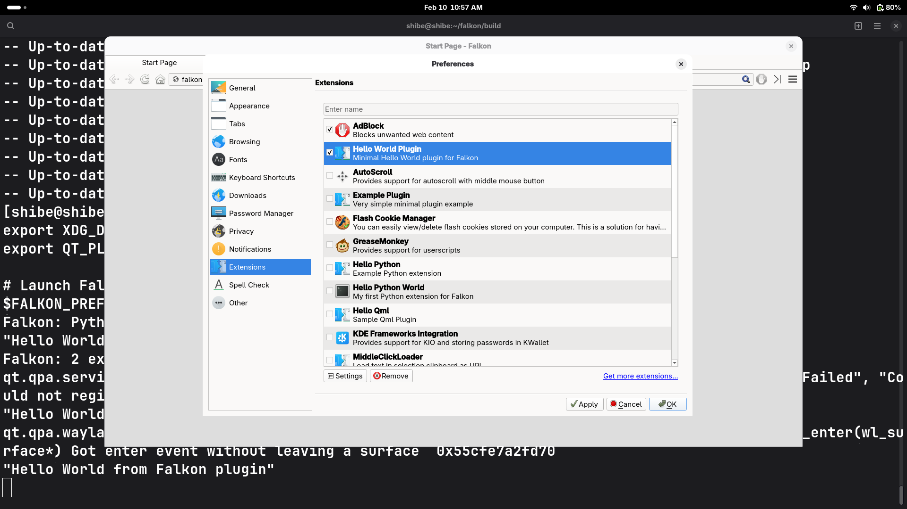

# Guide: Creating a C++ Extension for Falkon Browser

This guide walks through creating a basic "Hello World" plugin in falkon. 

---
###  1. Project Structure

Create a dedicated directory for your extension at `src/plugins/HelloWorld/`. You must include these four files to build a functional plugin:

- **`helloworld.json`**: The **Identity Card**. It provides plugin info (name, author, icon) to the browser UI.
    
- **`helloworld.h`**: The **Contract**. It defines the class structure and the "hooks" the browser uses to talk to your code.
    
- **`helloworld.cpp`**: The **Logic**. This is the "brain" where your actual C++ code lives.
    
- **`CMakeLists.txt`**: The **Blueprint**. It tells the compiler how to turn your text files into a machine-readable plugin.
    

---

###  2.`helloworld.json`

This file allows Falkon to display your plugin in the "Extensions" menu without actually running any C++ code. This keeps the browser fast because it only "looks" at the plugin without "loading" it.

JSON

```json
{
  "Name": "Hello World Plugin",
  "Comment": "Minimal Hello World plugin for Falkon",
  "Icon": "configure",
  "X-Falkon-Settings": "true",
  "X-Falkon-Version": "0.1.7"
}
```

- **`X-Falkon-Settings`**: Setting this to `true` tells Falkon to enable the "Settings" button in the preferences window.
    
- **`Icon`**: Uses standard system icon names (e.g., `configure` or `preferences-system`).
    

---

### 3.`helloworld.h`

In C++, inheriting from **`PluginInterface`** is a promise. You are promising the browser that your class has specific functions like `init()` and `unload()`.

CPP

```cpp
#ifndef HELLOWORLD_H
#define HELLOWORLD_H

#include "plugininterface.h"
#include <QMessageBox>

class HelloWorld : public QObject, public PluginInterface
{
    Q_OBJECT
    Q_INTERFACES(PluginInterface)
    // Links the JSON metadata to this header
    Q_PLUGIN_METADATA(IID "Falkon.Browser.plugin.HelloWorld" FILE "helloworld.json")

public:
    explicit HelloWorld();
    
    // Mandatory hooks the browser calls
    void init(InitState state, const QString &settingsPath) override;
    void unload() override;
    bool testPlugin() override;
    void showSettings(QWidget *parent) override;
};

#endif
```

- **`Q_INTERFACES`**: Acts as a "handshake" that allows the browser to safely cast your code into a plugin it can use.
    
- **`IID`**: A unique ID for your plugin. If two plugins have the same IID, the browser will refuse to load the second one.
    

---

### 4.`helloworld.cpp`

This is where the actual action happens. When you enable the plugin, the `init()` function runs.

CPP

```cpp
#include "helloworld.h"
#include "../config.h"
#include <QDebug>

HelloWorld::HelloWorld() : QObject() {}

void HelloWorld::init(InitState state, const QString &settingsPath) {
    Q_UNUSED(state)
    Q_UNUSED(settingsPath)
    
    // Prints a message to the terminal for debugging
    qDebug() << QStringLiteral("Hello World from Falkon plugin!");
}

void HelloWorld::unload() {
    // Logic to clean up when the plugin is disabled
}

bool HelloWorld::testPlugin() {
    // Safety check: only load if the plugin matches the browser version
    return (QString::fromLatin1(Qz::VERSION) == QLatin1String(FALKON_VERSION));
}

void HelloWorld::showSettings(QWidget *parent) {
    // Shows a popup message when the 'Settings' button is clicked
    QMessageBox::information(parent, tr("Hello"), tr("Hello World from Falkon!"));
}
```

- **`testPlugin()`**: Crucial for stability. It prevents the browser from crashing if your plugin was built for a different version of Falkon.
    
- **`QStringLiteral`**: A memory-efficient way to handle text in C++ that avoids unnecessary copies.
    

---

### 5.`CMakeLists.txt`

This file tells the **CMake** build system how to compile your source files into a **Shared Object (`.so`)** file.

CMake

```txt
set(HelloWorld_SRCS helloworld.cpp helloworld.h)

# Handles UI translations automatically
ecm_create_qm_loader(HelloWorld_SRCS falkon_helloworld_qt)

# Build as a MODULE (a dynamically loadable plugin)
add_library(HelloWorld MODULE ${HelloWorld_SRCS})

# Link your plugin to the main Falkon library
target_link_libraries(HelloWorld FalkonPrivate)

# Install the finished .so file to the plugins directory
install(TARGETS HelloWorld DESTINATION ${FALKON_INSTALL_PLUGINDIR})
```

- **`MODULE`**: Tells the compiler this code is meant to be plugged into another app at runtime, not run as a standalone program.
    

---

### 6. Compiling and Running

1. **Register the plugin**: Add `add_subdirectory(HelloWorld)` to the bottom of `src/plugins/CMakeLists.txt`.
    
2. **Build**:
    
    
    ```bash
    cd ~/falkon/build
    cmake -DCMAKE_INSTALL_PREFIX=./install -DQUICK_INSTALL=ON ..
    make -j$(nproc) install
    ```
    
3. **Set the Environment**: You must tell your OS where the new plugin is, or it will only look in system folders (like `/usr/lib`).
    
    
    ```bash
    export FALKON_PREFIX=$HOME/falkon/build/install
    export XDG_DATA_DIRS="$FALKON_PREFIX/share:$XDG_DATA_DIRS"
    export QT_PLUGIN_PATH="$FALKON_PREFIX/lib/plugins:$QT_PLUGIN_PATH"
    
    # Launch Falkon
    $FALKON_PREFIX/bin/falkon
    ```
    
4. **Activate**: Open Falkon, go to **Preferences > Extensions**, and check the box for **Hello World Plugin**


5. **Look at your output**
